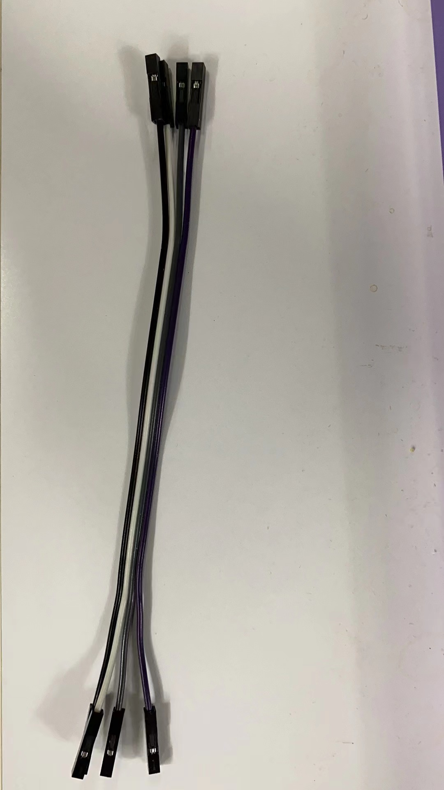
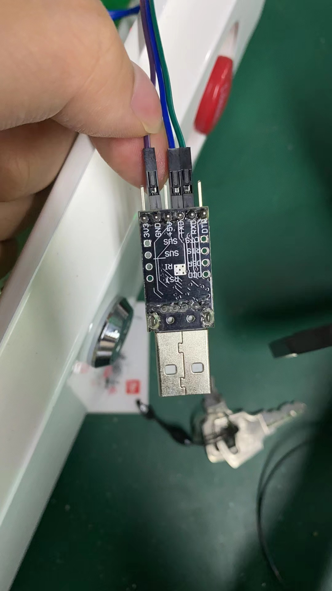
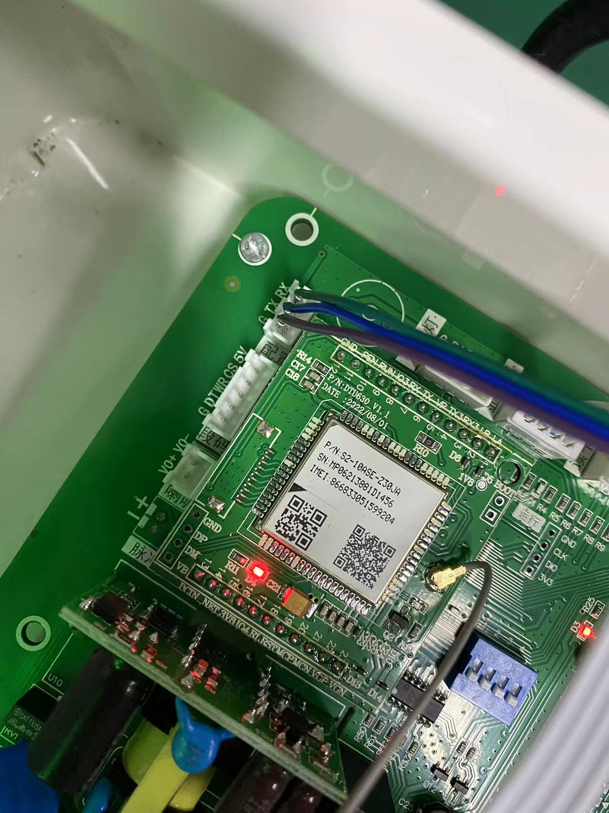
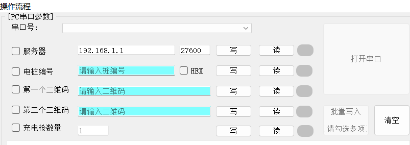

A self-hosted, lightweight implementation of a protocol server for cloud fast charging.

> :warning: This project is under development, please do not use in production environment. The original protocol can be viewed [here](doc/云快充平台协议V1.6.pdf) 


## Quick Start

> :warning: Before you start, make sure your device can access your server.


You can find latest release [here](https://github.com/LLLLimbo/ykc-proxy-server/releases).

Run it with:

```shell
./ykc-proxy-server
```


Next, you need to change the server address your charging device is pointing to, using the format ${ip}:${port}. The specific modification method depends on your charging device. You can consult your device supplier for details, but I will also demonstrate using my test device as an example.

1. Download and install [CP210x USB to UART Bridge VCP Drivers](https://www.silabs.com/developers/usb-to-uart-bridge-vcp-drivers?tab=downloads)

2. Prepare breadboard jumper wires and 5 pin USB Header to USB Dupont Cable  

3. Connect in the following way (Please note that different brands of charging device may have different ports connected!)

4. The manufacturer of charging device I tested with provided a configuration tool. However, not all manufacturers offer such tools, so you need to consult your device supplier.

5. If there are no problems with the above steps, you should see the following log output:

   ```json
   INFO[2023-05-22T14:27:44+08:00] new client connected                          address="39.144.11.48:37711"
   INFO[2023-05-22T14:27:53+08:00] received message                              encrypted=false frame_id=1 hex="[68 22 e7 91 00 01 12 34 56 20 23 03 78 01 01 0f 56 30 30 32 2e 30 35 36 00 89 86 04 52 16 19 70 10 71 96 00 67 e9]" length=34 seq=231
   DEBU[2023-05-22T14:27:53+08:00] [01] Verification message                     elc_type=1 guns=1 id=12345620230378 network=137 operator=103 protocol_version=1 sim=86045216197010719600 software_version=V002.056
   INFO[2023-05-22T14:28:03+08:00] received message                              encrypted=false frame_id=1 hex="[68 22 e8 91 00 01 12 34 56 20 23 03 78 01 01 0f 56 30 30 32 2e 30 35 36 00 89 86 04 52 16 19 70 10 71 96 00 64 02]" length=34 seq=232
   ```

   

   


## Build it yourself


## Currently supported messages

This is the current list of supported messages, you can find more detailed information [here](doc/message.md)


| 帧类型码 | 帧类型码名称                  | 数据传送方向     | 已支持             |
| -------- | ----------------------------- | ---------------- | ------------------ |
| 0x01     | 充电桩登录认证                | 充电桩->运营平台 | :white_check_mark: |
| 0x02     | 登录认证应答                  | 运营平台->充电桩 | :white_check_mark: |
| 0x03     | 充电桩心跳包                  | 充电桩->运营平台 | :white_check_mark: |
| 0x04     | 心跳包应答                    | 运营平台->充电桩 | :white_check_mark: |
| 0x05     | 计费模型验证请求              | 充电桩->运营平台 | :white_check_mark: |
| 0x06     | 计费模型验证请求应答          | 运营平台->充电桩 | :white_check_mark: |
| 0x09     | 充电桩计费模型请求            | 充电桩->运营平台 |                    |
| 0x0A     | 计费模型请求应答              | 运营平台->充电桩 |                    |
| 0x12     | 读取实时监测数据              | 运营平台->充电桩 |                    |
| 0x13     | 离线监测数据                  | 充电桩->运营平台 | :white_check_mark: |
| 0x15     | 充电握手                      | 充电桩->运营平台 |                    |
| 0x17     | 参数配置                      | 充电桩->运营平台 |                    |
| 0x19     | 充电结束                      | 充电桩->运营平台 |                    |
| 0x1B     | 错误报文                      | 充电桩->运营平台 |                    |
| 0x1D     | 充电阶段 BMS 中止             | 充电桩->运营平台 |                    |
| 0x21     | 充电阶段充电机中止            | 充电桩->运营平台 |                    |
| 0x23     | 充电过程 BMS 需求、充电机输出 | 充电桩->运营平台 |                    |
| 0x25     | 充电过程 BMS 信息             | 充电桩->运营平台 |                    |
| 0x31     | 充电桩主动申请启动充电        | 充电桩->运营平台 |                    |
| 0x32     | 运营平台确认启动充电          | 运营平台->充电桩 |                    |
| 0x33     | 远程启机命令回复              | 充电桩->运营平台 | :white_check_mark: |
| 0x34     | 运营平台远程控制启机          | 运营平台->充电桩 | :white_check_mark: |
| 0x35     | 远程停机命令回复              | 充电桩->运营平台 | :white_check_mark: |
| 0x36     | 运营平台远程停机              | 运营平台->充电桩 | :white_check_mark: |
| 0x3B     | 交易记录                      | 充电桩->运营平台 | :white_check_mark: |
| 0x40     | 交易记录确认                  | 运营平台->充电桩 |                    |
| 0x41     | 余额更新应答                  | 充电桩->运营平台 |                    |
| 0x42     | 远程账户余额更新              | 运营平台->充电桩 |                    |
| 0x43     | 卡数据同步应答                | 充电桩->运营平台 |                    |
| 0x44     | 离线卡数据同步                | 运营平台->充电桩 |                    |
| 0x45     | 离线卡数据清除应答            | 充电桩->运营平台 |                    |
| 0x46     | 离线卡数据清除                | 运营平台->充电桩 |                    |
| 0x47     | 离线卡数据查询应答            | 充电桩->运营平台 |                    |
| 0x48     | 离线卡数据查询                | 运营平台->充电桩 |                    |
| 0x51     | 充电桩工作参数设置应答        | 充电桩->运营平台 |                    |
| 0x52     | 充电桩工作参数设置            | 运营平台->充电桩 |                    |
| 0x55     | 对时设置应答                  | 充电桩->运营平台 |                    |
| 0x56     | 对时设置                      | 运营平台->充电桩 |                    |
| 0x57     | 计费模型应答                  | 充电桩->运营平台 |                    |
| 0x58     | 计费模型设置                  | 运营平台->充电桩 |                    |
| 0x61     | 地锁数据上送（充电桩上送）    | 充电桩->运营平台 |                    |
| 0x62     | 遥控地锁升锁与降锁命令(下行)  | 运营平台->充电桩 |                    |
| 0x63     | 充电桩返回数据（上行）        | 充电桩->运营平台 |                    |
| 0x91     | 远程重启应答                  | 充电桩->运营平台 |                    |
| 0x92     | 远程重启                      | 运营平台->充电桩 |                    |
| 0x93     | 远程更新应答                  | 充电桩->运营平台 |                    |
| 0x94     | 远程更新                      | 运营平台->充电桩 |                    |
| 0xA1     | 充电桩主动申请并充充电        | 充电桩->运营平台 |                    |
| 0xA2     | 运营平台确认并充启动充电      | 运营平台->充电桩 |                    |
| 0xA3     | 远程并充启机命令回复          | 运营平台->充电桩 |                    |
| 0xA4     | 运营平台远程控制并充启机      | 充电桩->运营平台 |                    |


## 